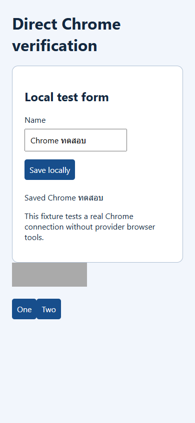
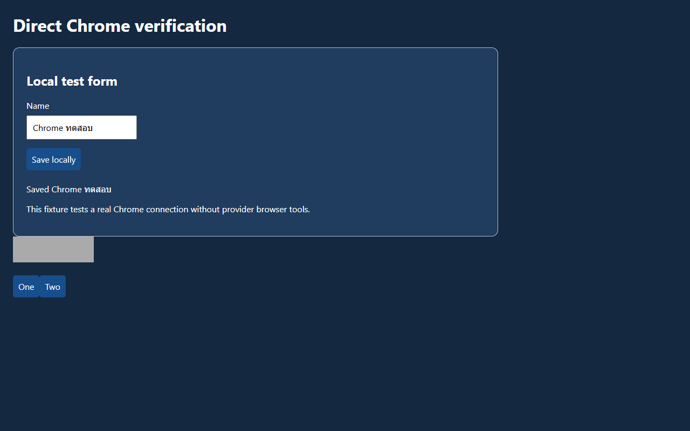

# ผลทดสอบ Web Debug 1.5.0

ตรวจวันที่ 28 กันยายน 2026 บน Windows 11 Home build 26200, Node.js v24.18.0 และ Chrome 154.0.8037.57

| ชุดทดสอบ | ผล |
|---|---|
| Unit / diagnostics / platforms / quality / adversarial / review security | 80 ผ่าน, 1 ข้าม (POSIX permissions บน Windows) |
| Chrome integration เดิม | 39/39 ผ่าน |
| Adversarial Chrome integration | 13/13 ผ่าน |
| Chrome regression จาก Skills review.md | 22/22 ผ่าน |
| ตัวติดตั้งและ knowledge ledger | 14/14 ผ่าน |
| Windows smoke | 7/7 ผ่านทั้ง PowerShell 7.6.5 และ Windows PowerShell 5.1 |
| Skill Creator validator | ผ่าน |
| ลิงก์เอกสารและความเท่ากันของไฟล์สกิลใน ZIP สองแบบ | ตรวจด้วย packaging script |

รวม **175 กรณีผ่าน และ 1 กรณีข้าม** โดยนับ Windows 7 กรณีเพียงครั้งเดียว แม้รันสอง PowerShell versions ชุด adversarial มี mutation corpus ของ plan ผิดรูปแบบ 100 ตัวอย่าง ซึ่งนับเป็นหนึ่ง test ไม่ขยายยอดเป็น 100 tests การเปรียบเทียบ validator ก่อน–หลัง 6 กรณีเป็นหลักฐานประกอบ ไม่บวกเข้ายอด tests ซ้ำ

## ขอบเขตที่ตรวจจริง

- เปิด Chrome แยกโปรไฟล์ เลือก target อย่างชัดเจน ใช้ pointer/keyboard/fill จริง อ่าน DOM/AX/console/network และสร้าง PNG/trace ที่ parse ได้
- ทดสอบ layout ผิดก่อนแก้และผ่านหลังแก้ รวมถึงภาษาไทย, SEO/indexing intent, JSON-LD, contrast แบบพื้นหลังทึบ และการข้าม gradient ที่วัดไม่ได้อย่างน่าเชื่อถือ
- โจมตี CLI/plan/report/ledger ด้วยข้อมูลผิดรูปแบบ ตรวจ symlink/junction/hardlink, output collision, ขนาดข้อมูล, UTF-16 JSON และ protocol messages ที่ผิด
- ทดสอบ focus เปลี่ยนระหว่าง action, checkbox ที่ไม่ควรถูก fill, opacity-zero ancestor, failed trace, promise ไม่ resolve, การรันชนกัน และการเก็บ emulation ของ client อื่น
- ทดสอบการย้ายโฟลเดอร์ความรู้ การแปลงพาธรุ่นเก่า การตรวจ snapshot/hash/วันที่ และการรักษาไฟล์เดิมของผู้ใช้เมื่อติดตั้ง
- ทดสอบ Windows ด้วยพาธที่มีช่องว่างและภาษาไทย พร้อม process ที่เปิดพอร์ตทดสอบ ยืนยันว่าเครื่องมือไม่หยุด process นั้นและไม่เขียนผ่าน output link
- ทดสอบ GitHub ด้วยข้อมูลจำลองตาม API, Cloudflare/security headers ด้วย HTTP fixture และทดสอบ redirect/credential/redaction boundaries
- ชุดเดิมยังผ่านหลังระบุ CLI permissions ที่เพิ่มในรุ่น 1.5 พร้อมตรวจว่า Chrome actions เดิม 24 แบบ, helper เดิม 14 ไฟล์ในรุ่น 1.4 และ reference เดิมยังมีอยู่ทั้งหมด เพิ่ม `waitForSelector` และ helper สำหรับ pipe/lifecycle สองไฟล์
- ทดสอบ private pipe, ปิด/ลบ owned profile, Git ignore ของ state/key, startup console/network capture, หน้าเว็บปลอม DOM/style APIs, HMAC scopes, external read-only, curated inputs, no-clobber และข้อมูล eval เกิน budget

ผลแก้รีวิวและข้อจำกัดรุ่นนี้อยู่ใน [REVIEW-RESPONSE.th.md](REVIEW-RESPONSE.th.md) ส่วน [AUDIT.th.md](AUDIT.th.md) เป็นรายงานย้อนหลังรุ่น 1.4 จำนวน tests หรือการมีไฟล์ครบไม่ได้พิสูจน์ว่าโมเดลตัดสินใจถูกทุกครั้ง

## หลักฐาน

- [Chrome integration](validation/browser-validation.json)
- [Unit และ TAP output](validation/unit-validation.json)
- [รีวิว Chrome 22 กรณี](validation/review-browser-validation.json)
- [เปรียบเทียบ validator 1.4 → 1.5](validation/review-baseline-comparison.json)
- [Adversarial Chrome และผลวัด](validation/adversarial-browser-validation.json)
- [ตัวติดตั้งและ ledger](validation/package-validation.json)
- [Windows PowerShell 7](validation/windows-ps7-validation.json)
- [Windows PowerShell 5.1](validation/windows-ps51-validation.json)
- [ขนาด entry/README และรายการความสามารถ](audit/optimization.json)
- [รายการความสามารถและขนาด entry รุ่น 1.5](audit/review-1.5-metrics.json)
- [หลักฐาน Cloudflare public probe จากรุ่น 1.2.0](validation/cloudflare-public-probe.json)

ภาพตัวอย่างจาก fixture เดิมแสดงผล mobile/desktop ที่ทดสอบไว้ พื้นที่สีเทาและปุ่ม One/Two ตั้งใจใช้ทดสอบ element ถูกบังและ selector ซ้ำ ไม่ใช่งานออกแบบเว็บไซต์ส่งมอบ:





## สิ่งที่ยังไม่ได้ยืนยัน

ยังไม่ได้ทดสอบ live Claude Code session, macOS/Linux, Node 22.4, runtime ภายใน WSL หรือ authenticated GitHub/Cloudflare ในเครื่องนี้ไม่มี gh จึงไม่ได้อ้างว่าเชื่อมบัญชี GitHub จริงแล้ว ผล Linux ที่ผู้รีวิวระบุไม่ถูกนับเป็นผลทดสอบของเรา POSIX mode-bit test ถูกข้าม และไม่ได้รับรอง inherited Windows ACL, renderer memory isolation หรือการป้องกัน filesystem races ทุกแบบ

แหล่งข้อมูล 40 แหล่งถูกเพิ่ม/ทดสอบ fetch ในรุ่นก่อนหน้า วันที่ใน registry แยกจาก semantic review และ status ปัจจุบันจะตรวจหลักฐาน local เพิ่ม การตรวจครั้งนี้มุ่งที่โค้ด/ความสอดคล้อง/การใช้งาน ไม่ใช่การรับรองว่าทุกข้อความจากเว็บยังถูกต้องตลอดไป

ผล Cloudflare public probe ที่แนบมาจากรุ่น 1.2.0: HTTP/TLS/cache และ OS resolver สำเร็จ แต่ direct DNS queries หมดเวลา จึงไม่อ้างว่าตรวจ DNS ได้ครบ หรือว่าทดสอบทุกเวอร์ชันของเครื่องมือกับ production แล้ว

ไม่มีการรับรอง ranking/AI citation, ความเป็นธรรมชาติจากการศึกษาผู้ใช้, rich results, accessibility compliance หรือความปลอดภัยทั้งระบบ ดูขอบเขตความเสี่ยงที่ยังเหลือในรายงาน audit

## รันทดสอบซ้ำ

```powershell
node --test tests/unit.test.mjs tests/diagnostics.test.mjs tests/platforms.test.mjs tests/quality.test.mjs tests/adversarial.test.mjs tests/review-security.test.mjs
node tests/browser-smoke.mjs --work work/browser-check
node tests/adversarial-browser.mjs --work work/adversarial-browser-check
node tests/review-browser.mjs --work work/review-browser-check
node tests/package-smoke.mjs --work work/package-check
node tests/windows-smoke.mjs --work "work/windows-check ภาษาไทย"
```

ใช้พื้นที่ work ในโครงการที่ได้รับอนุญาต Tests ปิด server/Chrome ที่สร้างเอง ชุดเดิมเก็บ artifacts/profile เพื่อการตรวจย้อนหลัง ส่วน review-browser ตรวจ cleanup และลบ profile ของตัวเองด้วย รัน Windows smoke ซ้ำด้วย `--shell powershell.exe` เพื่อทดสอบ Windows PowerShell 5.1
